<div align="center">

# HandEdit

### A Unified Benchmark for Egocentric Human-to-Robot Dexterous Hand Image Editing

[Project page](https://handedit.github.io/) · [Dataset](https://huggingface.co/datasets/HandEdit/HandEdit-Full) · [Evaluation toolkit](#evaluation-toolkit)

</div>

<div style="position: relative; line-height: 0;">
  <a href="assets/readme/teaser.mp4">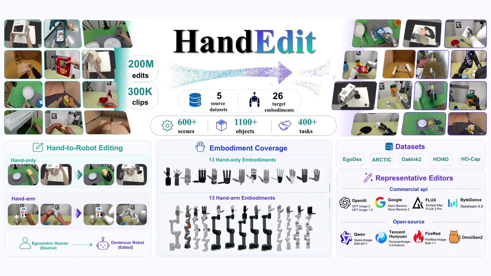</a>
  <video src="assets/readme/teaser.mp4" autoplay muted loop playsinline controls preload="metadata" poster="assets/readme/teaser_poster.jpg" title="HandEdit overview video" style="position: absolute; inset: 0; width: 100%; height: 100%; object-fit: contain; background: #000;"></video>
</div>

## Overview

HandEdit is a large-scale dataset and benchmark for replacing human hands and arms in egocentric images with specified dexterous robotic embodiments. It provides URDF-conditioned evaluation for both hand-only and hand-arm editing.

| Source datasets | Video clips | Editing instances | Robot embodiments |
|:--:|:--:|:--:|:--:|
| 5 | 300K+ | 200M+ | 26 |

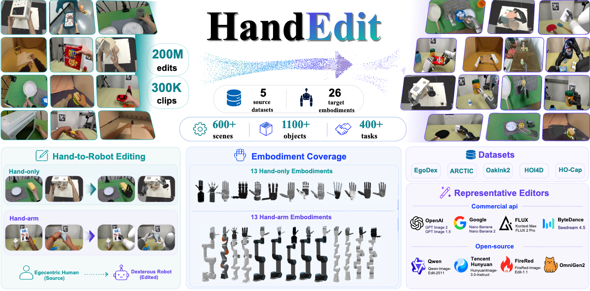

## Dataset and benchmark

HandEdit is built from EgoDex, ARCTIC, OakInk2, HOI4D, and HO-Cap. It covers 13 hand-only and 13 hand-arm embodiments across two benchmark tracks:

- **Hand-only:** replace the visible human hand with a target robot hand.
- **Hand-Arm:** replace the visible hand-arm region with a target robot arm-hand embodiment.

The [full dataset and release metadata](https://huggingface.co/datasets/HandEdit/HandEdit-Full) are available on Hugging Face.

## Pseudo-GT construction and quality

The pseudo-GT pipeline combines human-region segmentation, background restoration, kinematic retargeting, robot rendering, and compositing. Automatic checks and human screening are applied throughout the pipeline.

### Harmonized pseudo-references

We train a lightweight Harmonizer on 10,000 natural egocentric hand images and apply it to the rendered robot region. It improves lighting, color, and boundary consistency while keeping robot pose and hand-object geometry unchanged. We use the harmonized references for an additional analysis on one tenth of the official test set; the main benchmark retains the original composites.

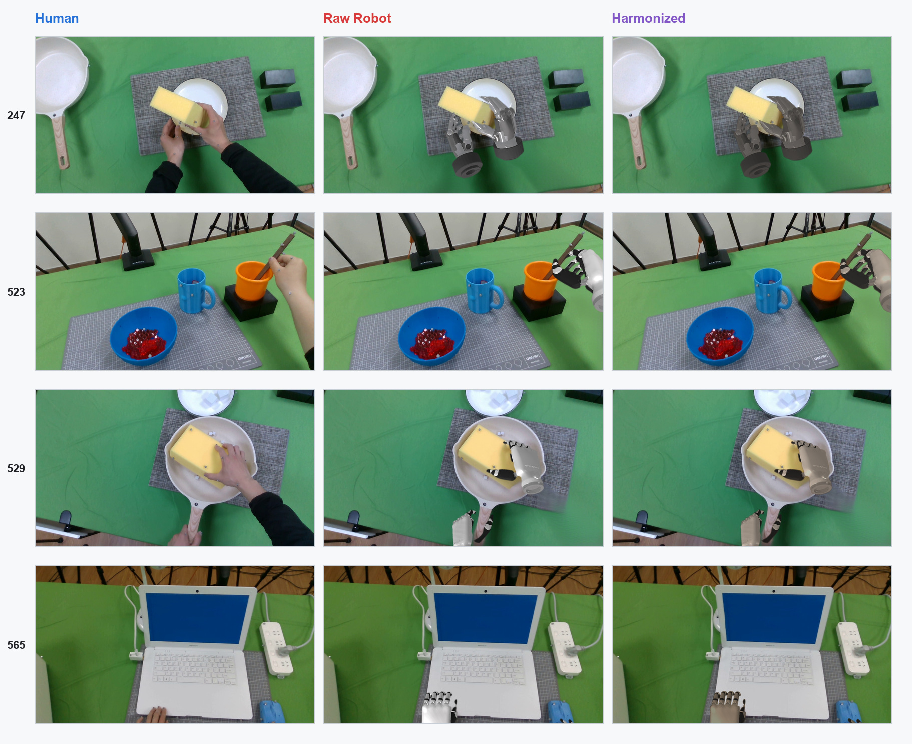

[Harmonizer inference wrapper and checkpoint](harmonizer/)

### Pseudo-GT quality audit

We uniformly sample 5,000 frames from the 734,864 final non-kept ARCTIC frames and assign one primary failure cause to each frame.

| Primary failure cause | Count | Share of audited non-kept samples |
|---|---:|---:|
| Hand retargeting | 3,173 / 5,000 | 63.46% |
| Segmentation | 927 / 5,000 | 18.54% |
| Background restoration / inpainting | 586 / 5,000 | 11.72% |
| Rendering / compositing | 314 / 5,000 | 6.28% |

These percentages describe the rejected ARCTIC pool only; they are not extrapolated to retained samples or the other source datasets.

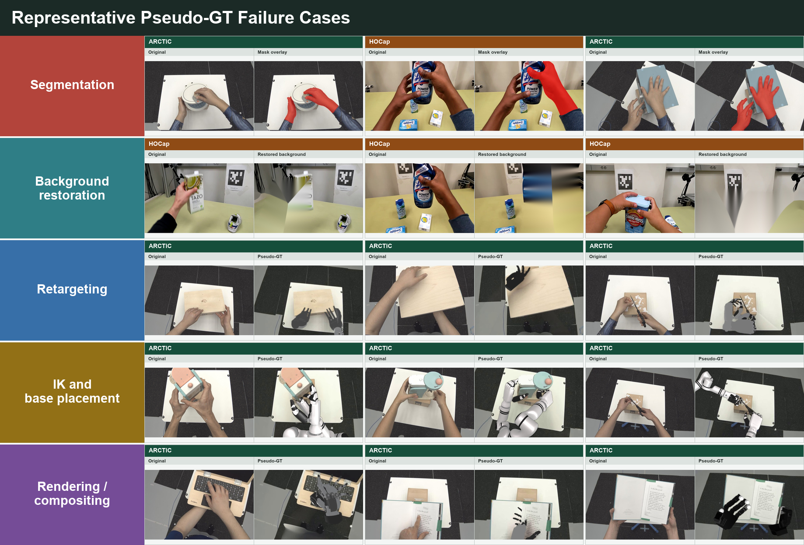

### Virtual base for the Hand-Arm track

For each sequence and target embodiment, the robot base is selected once and then fixed for every frame. We search 27 base candidates, reject candidates with IK-infeasible critical frames, joint-limit violations, or collisions, and inspect the top three valid sequence-level candidates. Sequences with no plausible placement are excluded.

Each clip is arranged as **human operation · robot third-person view · robot first-person view**.

#### Accepted fixed-base placements

**ARCTIC** — `s04__box_use_01_view0`, frames 39–326

<div style="position: relative; line-height: 0;">
  <a href="assets/readme/virtual_base_arctic_accepted.mp4">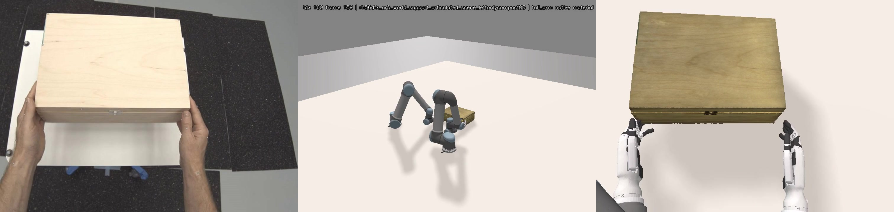</a>
  <video src="assets/readme/virtual_base_arctic_accepted.mp4" autoplay muted loop playsinline controls preload="metadata" poster="assets/readme/virtual_base_arctic_accepted_poster.jpg" title="Accepted ARCTIC fixed-base placement" style="position: absolute; inset: 0; width: 100%; height: 100%; object-fit: contain; background: #000;"></video>
</div>

**HO-Cap** — `subject7_20231023_163653`, frames 210–509

<div style="position: relative; line-height: 0;">
  <a href="assets/readme/virtual_base_hocap_accepted.mp4">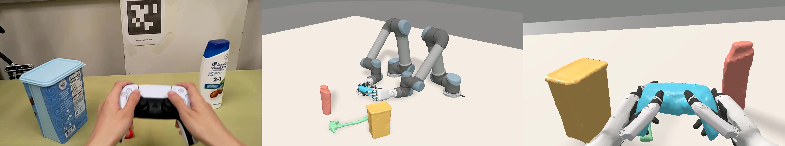</a>
  <video src="assets/readme/virtual_base_hocap_accepted.mp4" autoplay muted loop playsinline controls preload="metadata" poster="assets/readme/virtual_base_hocap_accepted_poster.jpg" title="Accepted HO-Cap fixed-base placement" style="position: absolute; inset: 0; width: 100%; height: 100%; object-fit: contain; background: #000;"></video>
</div>

#### Rejected Hand-Arm feasibility cases

The following sequences preserve the fixed base but fail the feasibility review, so they are not released as pseudo-GT.

**ARCTIC** — delayed arm control and static object

<div style="position: relative; line-height: 0;">
  <a href="assets/readme/virtual_base_arctic_rejected.mp4">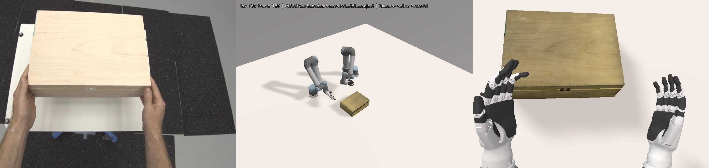</a>
  <video src="assets/readme/virtual_base_arctic_rejected.mp4" autoplay muted loop playsinline controls preload="metadata" poster="assets/readme/virtual_base_arctic_rejected_poster.jpg" title="Rejected ARCTIC Hand-Arm feasibility case" style="position: absolute; inset: 0; width: 100%; height: 100%; object-fit: contain; background: #000;"></video>
</div>

**HO-Cap** — wrist flip and missed grasp

<div style="position: relative; line-height: 0;">
  <a href="assets/readme/virtual_base_hocap_rejected.mp4">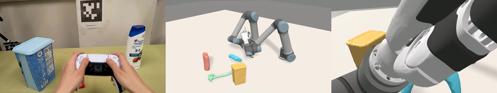</a>
  <video src="assets/readme/virtual_base_hocap_rejected.mp4" autoplay muted loop playsinline controls preload="metadata" poster="assets/readme/virtual_base_hocap_rejected_poster.jpg" title="Rejected HO-Cap Hand-Arm feasibility case" style="position: absolute; inset: 0; width: 100%; height: 100%; object-fit: contain; background: #000;"></video>
</div>

## Human-to-robot editing with LongCat-Image

As one use case, we LoRA-fine-tune LongCat-Image on aligned HandEdit pairs (rank 32, two epochs). The model replaces the human hand with an Inspire robot hand while retaining the object, contact, background, and viewpoint.

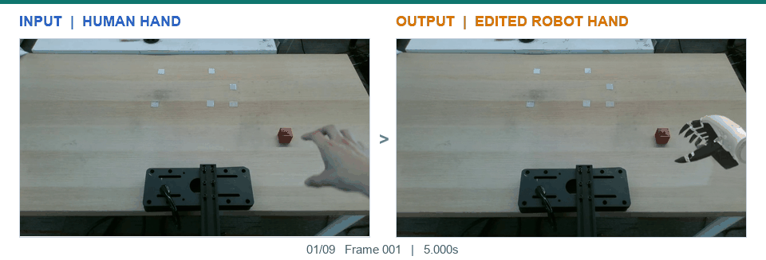

<details>
<summary>View all nine matched examples</summary>

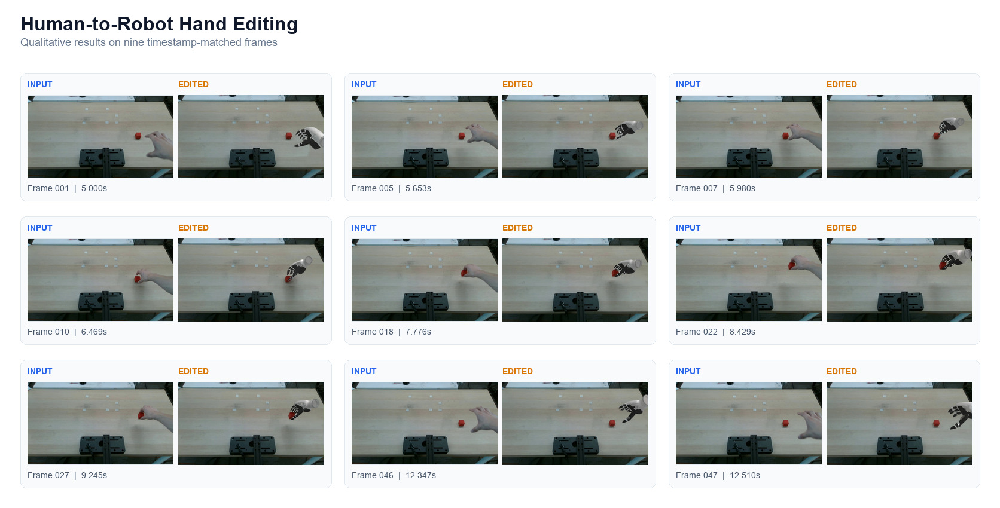

</details>

## Benchmark evaluation

We evaluate 11 representative image editors using generic similarity, VLM judgment, and embodiment-aware measures of hand removal, robot structure and identity, and interaction retention.

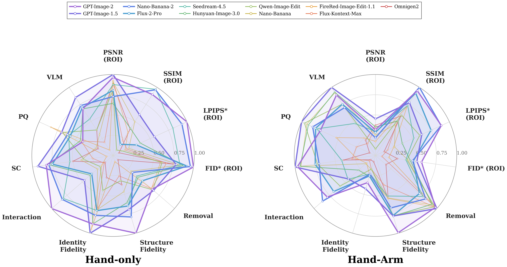

## Evaluation toolkit

### Install

```bash
conda create -n handedit-eval python=3.10 -y
conda activate handedit-eval
pip install -r requirements.txt
```

DINOv2 and CLIP checkpoints are not included. Download them separately and pass their local paths to `eval.py`.

<details>
<summary>Manifest format and evaluation commands</summary>

The evaluator reads one JSON object per line:

```json
{"id":"000001","replacement_scope":"hand-only","target_name":"Shadow Hand","src_path":"data/src/000001.png","pred_path":"data/pred/000001.png","gt_path":"data/gt/000001.png","gt_mask_path":"data/gt_mask/000001.png","test_mask_path":"data/pred_mask/000001.png","human_mask_path":"data/human_mask/000001.png","robot_mask_path":"data/robot_mask/000001.png","object_mask_path":"data/object_mask/000001.png","urdf_ref_paths":["data/urdf/shadow/view_0.png","data/urdf/shadow/view_1.png"],"urdf_mask_paths":["data/urdf_mask/shadow/view_0.png","data/urdf_mask/shadow/view_1.png"]}
```

Build a manifest:

```bash
python build_manifest.py \
  --src-root data/src \
  --pred-root data/pred \
  --gt-root data/gt \
  --gt-mask-root data/gt_mask \
  --test-mask-root data/pred_mask \
  --human-mask-root data/human_mask \
  --robot-mask-root data/robot_mask \
  --object-mask-root data/object_mask \
  --replacement-scope hand-only \
  --target-name "Shadow Hand" \
  --urdf-refs data/urdf/shadow/view_0.png data/urdf/shadow/view_1.png \
  --urdf-masks data/urdf_mask/shadow/view_0.png data/urdf_mask/shadow/view_1.png \
  --out-manifest manifests/shadow_hand_only.jsonl
```

Run evaluation:

```bash
python eval.py \
  --manifest manifests/shadow_hand_only.jsonl \
  --experiment shadow_hand_only \
  --output-dir runs \
  --device cuda \
  --shape-model models/dinov2 \
  --clip-model models/clip
```

Results are written to `runs/<experiment>/metrics/`. ROI metrics use the union of the human and robot masks; if neither is available, the evaluator falls back to the full image.

</details>

The toolkit reports PSNR, SSIM, LPIPS, and FID together with Removal, Struct Fidelity, ID Fidelity, Interaction, and VLM scores.
